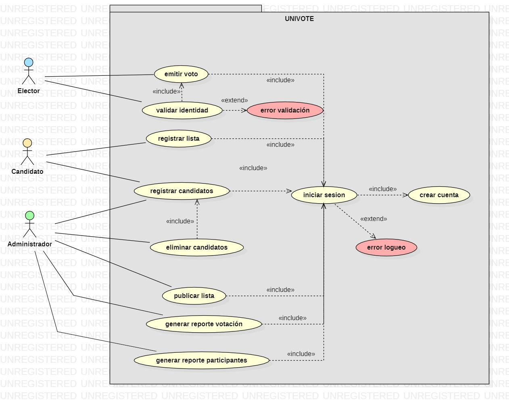
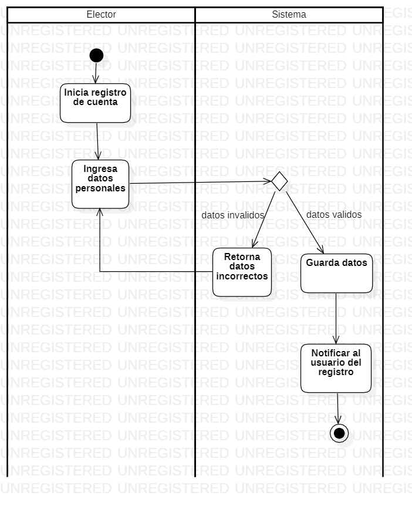
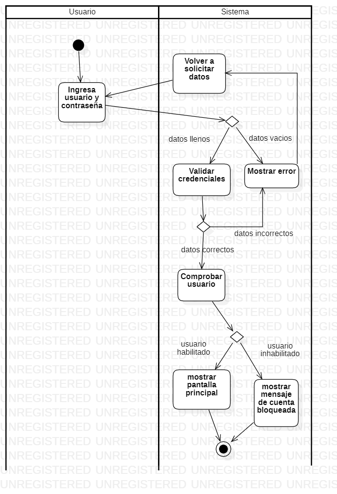
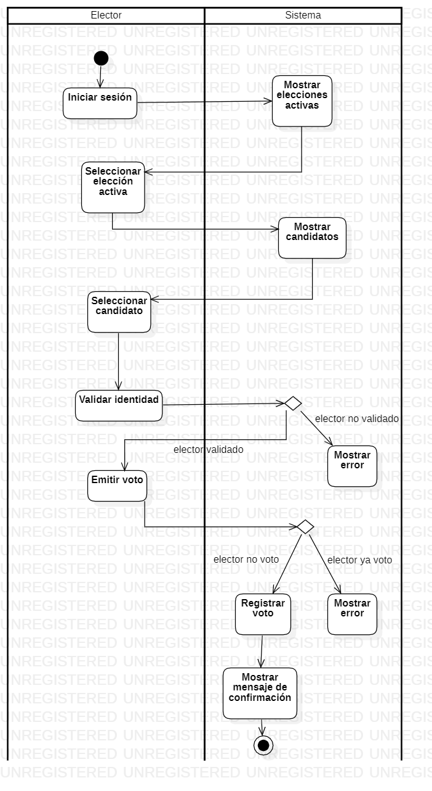
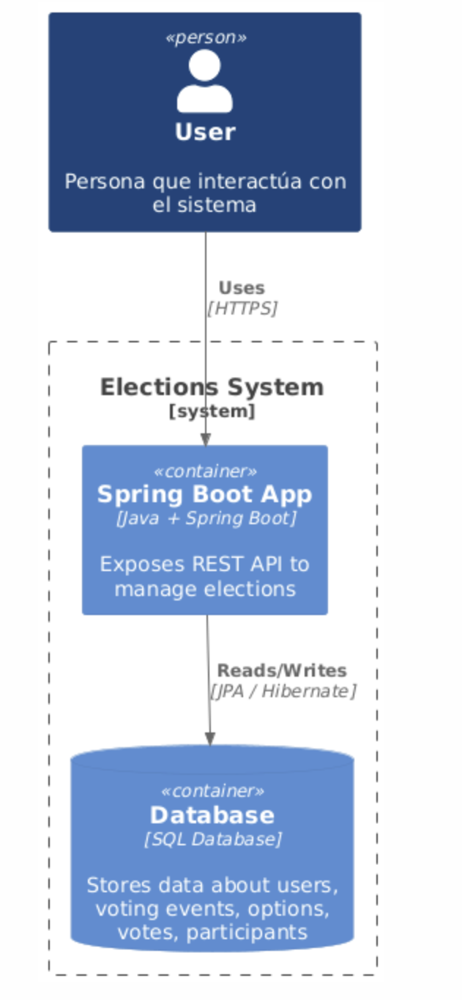
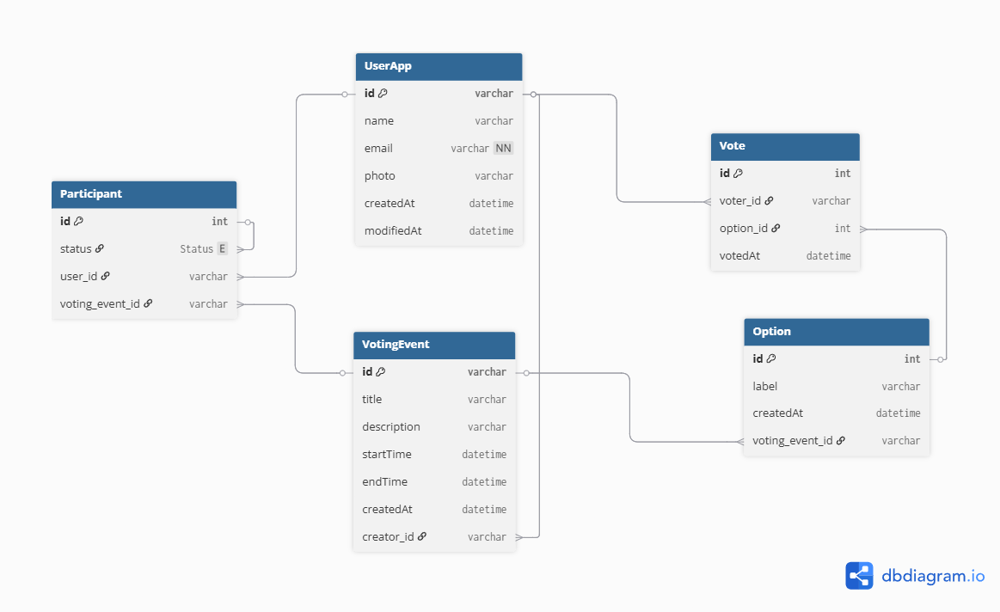

### JustVote 🗳️

## 📌 Propuesta

JustVote es un sistema web que:

- Centraliza la gestión de eventos electorales, permitiendo organizar todo tipo de votaciones, desde elecciones formales (como centros de estudiantes, consejos facultativos, etc.) hasta votaciones más informales o temáticas (como elección de sabores de helado, temas de exposición, representantes por actividad, etc.).

- Automatiza todo el proceso electoral, desde el registro de candidatos hasta el conteo y publicación de resultados, con generación de reportes y seguimiento del proceso.

- Garantiza seguridad, transparencia y accesibilidad, asegurando que cada votación sea única, verificable y confidencial, y que cualquier usuario autorizado pueda participar desde diferentes dispositivos y ubicaciones.

## 📌 Diagramas del Sistema

### ✅ Diagrama de Casos de Uso

---

### ✅ Diagramas de Actividades

#### 🔹 Crear cuenta

#### 🔹 Iniciar sesión

#### 🔹 Emitir voto

---

### ✅ Diagrama de Arquitectura

---

### ✅ Diagrama de Clases

---

### ✅ Diagrama de Base de Datos

## 📌 Interfaz Gráfica

## 📌 Pruebas
